# Molecular Subtyping of Elderly Thyroid Carcinoma Reveals Distinct Biological Programs and Clinical Implications: A Multi-Omics Integrative Analysis

## Authors

[Author names to be added]

## Abstract

**Background:** Thyroid carcinoma management in elderly patients (>=60 years) remains challenging due to increased surgical risk and poorly characterized age-specific tumor biology. Whether elderly papillary thyroid carcinoma (PTC) harbors distinct molecular subtypes with differential clinical behavior is unknown.

**Methods:** We analyzed 120 elderly PTC patients from the TCGA-THCA cohort using consensus clustering on RNA-seq data (top 3,000 variable genes, 1,000 bootstrap resamples). Subtypes were characterized across mutation landscape, pathway activity (GSVA, 11 gene sets), immune microenvironment (8 cell-type markers, 7 checkpoints), aging/senescence signatures, thyroid differentiation score (TDS), and clinical features. Single-cell RNA-seq (GSE184362, 23 samples) provided mechanistic validation. Drug sensitivity was predicted for 8 drug classes, and a machine learning classifier was trained for subtype assignment.

**Results:** Two highly stable molecular subtypes were identified (PAC = 0.084, silhouette = 0.95). Subtype C1 (n = 41) was RAS-like (NRAS 21.6%, BRAF 0%), with higher oxidative phosphorylation, lower EMT, and minimal lymph node metastasis (2.4%). Subtype C2 (n = 79) was BRAF-like (BRAF V600E 87.2%, NRAS 0%), with elevated EMT, adhesion, senescence-associated secretory phenotype (SASP), immunosenescence, and markedly higher lymph node metastasis (44.3%; Fisher p = 0.0005 for stage distribution). Drug sensitivity analysis suggested C1 patients may benefit from radioactive iodine (RAI) therapy, while C2 patients showed higher sensitivity to BRAF/MEK inhibitors and elevated immune checkpoint expression. A Random Forest classifier achieved 97.6% balanced accuracy for subtype prediction.

**Conclusions:** Elderly PTC harbors two molecularly and clinically distinct subtypes. The indolent C1 subtype may be candidates for active surveillance, while the aggressive C2 subtype warrants more intensive intervention. This framework provides a foundation for personalized clinical decision-making in elderly thyroid carcinoma.

**Keywords:** thyroid carcinoma, elderly, molecular subtyping, multi-omics, TCGA, immune microenvironment, drug sensitivity, clinical decision support

---

## 1. Introduction

Thyroid carcinoma is the most common endocrine malignancy, with papillary thyroid carcinoma (PTC) accounting for approximately 85% of cases [1]. While PTC generally carries an excellent prognosis, the management of elderly patients presents unique clinical challenges. Patients aged 60 and above face increased surgical risk due to comorbidities, higher rates of anesthesia-related complications, and a distinct tumor biology that has been inadequately characterized at the molecular level [2,3].

The Cancer Genome Atlas (TCGA) landmark study of PTC identified two major molecular subtypes—BRAF-like and RAS-like—with distinct signaling, differentiation, and immune characteristics [4]. However, this classification was derived from the entire patient population without age-specific stratification. Given that aging profoundly affects tumor biology through mechanisms including cellular senescence, immunosenescence, altered metabolic programming, and modified tumor-immune interactions [5,6], it is plausible that elderly PTC harbors distinct molecular heterogeneity requiring age-specific analysis.

Recent studies have begun to explore aging-related mechanisms in thyroid cancer. An integrative multi-omics analysis demonstrated that aging (>=55 years) independently drives PTC aggressiveness through chromosomal alterations and depleted CD8+ T cell infiltration [7]. Cell senescence-related signatures have been linked to prognosis in PTC [8,9], and immunosenescence-associated plasma protein biomarkers have been identified for thyroid cancer risk [10]. Additionally, proteogenomic approaches have revealed novel molecular subtypes in advanced differentiated thyroid cancer [11]. However, no study has systematically performed molecular subtyping specifically within elderly PTC patients or linked such subtypes to clinical decision-making.

The clinical imperative is clear: elderly patients face a dilemma between surgical intervention (with its attendant risks) and active surveillance (with potential for disease progression). A molecular framework that stratifies elderly PTC into biologically and clinically meaningful subtypes could guide personalized management decisions—identifying patients who can safely forgo surgery versus those who require aggressive intervention.

In this study, we performed comprehensive molecular subtyping of 120 elderly PTC patients (>=60 years) from the TCGA-THCA cohort, integrating mutation landscape, pathway activity, immune microenvironment, aging/senescence signatures, metabolic reprogramming, and clinical features. We validated mechanistic insights using single-cell RNA-seq data and predicted drug sensitivity across multiple therapeutic classes. Finally, we constructed a machine learning classifier and proposed a clinical decision framework for elderly thyroid carcinoma management.

## 2. Materials and Methods

### 2.1 Data Sources and Cohort Construction

**TCGA-THCA bulk multi-omics data** were downloaded from the Genomic Data Commons (GDC) using TCGAbiolinks (v2.30) [12]. RNA-seq gene expression data (STAR-Counts workflow, HTSeq counts and TPM), somatic mutation data (Masked Somatic Mutation, MAF format), and clinical information were obtained for the TCGA-THCA project. A total of 572 samples were available, of which 505 were primary tumor samples (sample type "TP").

The **elderly cohort** was defined as patients aged >=60 years at diagnosis, yielding 120 samples. A sensitivity analysis with a >=50 cutoff (n = 224) was planned for validation.

**Single-cell RNA-seq data** were obtained from GEO accession GSE184362, comprising 23 samples from 11 PTC patients, including tumor (T), paratumor (P), lymph node metastasis (LN), and subcutaneous (SC) tissue samples in 10x Chromium format.

### 2.2 Gene Expression Preprocessing

TPM values were log2-transformed (log2(TPM + 1)). Genes with median TPM < 1 across primary tumor samples were removed, retaining 16,404 genes. ENSEMBL gene identifiers were converted to HGNC gene symbols using the gene annotation from the SummarizedExperiment object, yielding 16,375 unique genes after removing duplicates.

### 2.3 Molecular Subtyping

Feature selection was performed by computing the median absolute deviation (MAD) across elderly samples, selecting the top 3,000 most variable genes. Expression values were z-score normalized (row-scaled).

Consensus clustering was performed using ConsensusClusterPlus (v1.66) [13] with the following parameters: maximum k = 6, 1,000 resampling iterations, 80% item subsampling, hierarchical clustering with Pearson correlation distance and Ward.D2 linkage, seed = 42. The optimal number of clusters was determined using the proportion of ambiguous clustering (PAC) score [14] and mean silhouette width.

### 2.4 Mutation Landscape Analysis

Somatic mutations from MAF files were analyzed for driver gene frequency per subtype. Key driver genes examined included BRAF, NRAS, HRAS, KRAS, RET, TP53, PIK3CA, PTEN, AKT1, and TERT. Tumor mutational burden (TMB) was calculated as total nonsynonymous mutations divided by the approximate exome size (30 Mb).

### 2.5 Pathway Activity Scoring (GSVA)

Gene set variation analysis (GSVA) [15] was performed using curated gene sets representing 11 biological programs: epithelial-mesenchymal transition (EMT), proliferation, angiogenesis, cell adhesion, glycolysis, oxidative phosphorylation (OXPHOS), senescence-associated secretory phenotype (SASP), cellular senescence, immunosenescence, DNA repair, and apoptosis. Gene sets were defined from established literature sources and the Molecular Signatures Database (MSigDB) hallmark collection [16].

### 2.6 Thyroid Differentiation Score (TDS)

The TDS was calculated as the mean log2(TPM + 1) expression of 10 thyroid differentiation genes: TG, TPO, SLC26A4, DIO1, DIO2, DUOX1, DUOX2, FOXE1, PAX8, and TSHR, following the approach established by the TCGA thyroid cancer study [4].

### 2.7 Immune Microenvironment Analysis

Immune cell infiltration was estimated using marker-based scoring for 8 cell populations: CD8+ T cells (CD8A, CD8B, GZMA, GZMB, PRF1, IFNG), regulatory T cells (FOXP3, IL2RA, CTLA4, IKZF2), M1 macrophages (NOS2, CD80, CD86, TNF, IL1B), M2 macrophages (CD163, MRC1, MSR1, CD68, IL10), natural killer cells (NCR1, KLRK1, KLRD1, NKG7), B cells (CD19, MS4A1, CD79A, PAX5), cancer-associated fibroblasts (FAP, ACTA2, PDGFRA, PDGFRB, COL1A1, THY1), and myeloid-derived suppressor cells (S100A8, S100A9, ARG1). For each cell type, the score was calculated as the mean log2(TPM + 1) of the corresponding marker genes present in the expression matrix.

Immune checkpoint expression was profiled for CD274 (PD-L1), PDCD1 (PD-1), CTLA4, LAG3, HAVCR2 (TIM-3), TIGIT, and CD276 (B7-H3).

Immune dysfunction and exclusion were assessed using a simplified TIDE-like scoring approach [17], with dysfunction markers (PDCD1, CTLA4, LAG3, HAVCR2, TIGIT, TOX, EOMES, BATF) and exclusion markers (TGFB1, TGFB2, TGFB3, COL1A1, COL1A2, FAP, ACTA2, FN1, VIM).

### 2.8 Senescence Biomarker Analysis

Seven senescence-related gene signatures were curated from established literature: SenMayo (55 genes, Saul et al. 2022 [23]), SASP Atlas (51 genes, Basisty et al. 2020 [24]), Cell Cycle Arrest (19 core senescence markers), Telomere Maintenance (18 genes), DDR-Senescence (17 DNA damage response genes), Immunosenescence (21 T cell exhaustion/aging markers), and Senescent Anti-apoptosis (10 pro-survival genes). GSVA scoring was applied across all 505 primary tumors. A composite senescence score was computed as the mean of all seven signature scores. Spearman correlation tested the relationship between senescence and chronological age. Multivariate logistic regression assessed senescence as an independent predictor of lymph node metastasis, controlling for age, BRAF mutation status, and gender. Receiver operating characteristic (ROC) analysis evaluated predictive performance using the pROC package [25].

### 2.9 Clinical Association Analysis

Clinical endpoints included AJCC pathologic stage, lymph node metastasis (N0 vs N1), and overall survival. Stage distribution differences between subtypes were assessed using Fisher's exact test with simulated p-values. Kaplan-Meier survival curves were compared using the log-rank test. Clinical summary statistics were generated per subtype.

### 2.9 Single-Cell RNA-seq Analysis

Raw 10x Chromium data (barcodes, features, matrix) were processed using scanpy (v1.10) [18]. Quality control filters removed cells with <200 or >6,000 genes and >20% mitochondrial reads. Data were normalized to 10,000 counts per cell, log-transformed, and 3,000 highly variable genes were selected with batch-aware HVG detection. Principal component analysis (50 components) was followed by Harmony batch correction [19] across samples. UMAP embedding and Leiden clustering (resolution 0.8) were computed. Cell types were annotated using established marker genes for thyrocytes, T cell subsets, macrophages, B cells, fibroblasts, endothelial cells, and dendritic cells. Differential expression between tumor and paratumor was performed using the Wilcoxon rank-sum test.

### 2.10 Drug Sensitivity Prediction

Drug sensitivity was assessed using a target expression scoring approach for 8 drug classes: BRAF inhibitors, MEK inhibitors, lenvatinib targets, sorafenib targets, CDK inhibitors, mTOR inhibitors, anti-PD1 response markers, and radioactive iodine (RAI) sensitivity. For each drug class, target genes were compiled from pharmacological literature, and the score was computed as the mean expression of target genes present in the expression matrix.

Actionable target expression was profiled for 17 established druggable genes (BRAF, RET, NTRK1-3, ALK, ROS1, MET, MTOR, PIK3CA, PTEN, VEGFA, KDR, FGFR1-2, CDK4, CDK6).

### 2.11 Machine Learning Classifier

Feature selection was performed using one-way ANOVA F-tests across subtypes, selecting the top 100 most discriminating genes. Expression values were standardized (z-score). Three classifiers were evaluated: Logistic Regression (C = 0.1), Random Forest (200 estimators), and Gradient Boosting (100 estimators). Performance was assessed using 5-fold stratified cross-validation with balanced accuracy as the primary metric. Feature importance was extracted from the Random Forest model.

### 2.12 Statistical Analysis

All statistical analyses were performed in R (v4.3.3) and Python (v3.11). Multiple testing correction was applied where appropriate using the Benjamini-Hochberg method. Statistical significance was defined as p < 0.05.

## 3. Results

### 3.1 Cohort Characteristics

From 505 primary tumor samples in TCGA-THCA, 120 elderly patients (>=60 years) were identified with a mean age of 69.0 years (range: 60–89). The cohort was predominantly female (61.7%, 74/120) and male (38.3%, 46/120), consistent with the known female predominance in thyroid cancer.

### 3.2 Two Robust Molecular Subtypes in Elderly PTC

Consensus clustering identified k = 2 as the optimal number of subtypes, with exceptional stability metrics: PAC = 0.084 (lowest across k = 2–6) and mean silhouette width = 0.95. Subtype C1 comprised 41 patients (34.2%) and C2 comprised 79 patients (65.8%) (Figure 1).

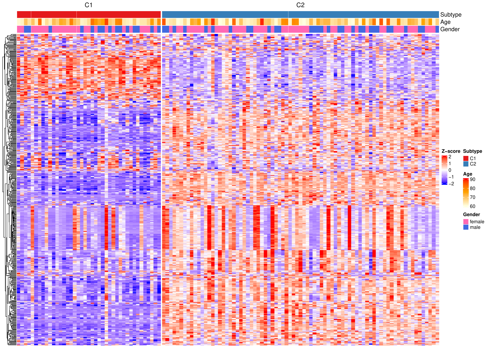

### 3.3 Distinct Mutational Drivers Define Each Subtype

The two subtypes exhibited strikingly divergent mutational profiles. **Subtype C1** was characterized by RAS family mutations: NRAS (21.6%), HRAS (8.1%), and KRAS (2.7%), with complete absence of BRAF mutations (0%). **Subtype C2** was dominated by BRAF V600E (87.2%), with no NRAS or HRAS mutations detected (Figure 2, Table 2). This dichotomy mirrors the classical TCGA BRAF-like versus RAS-like classification [4] but is here demonstrated specifically within the elderly population.

**Table 2. Driver mutation frequency by subtype.**

| Gene | C1 (n=37*) | C2 (n=78*) |
|------|-----------|-----------|
| BRAF | 0% | 87.2% |
| NRAS | 21.6% | 0% |
| HRAS | 8.1% | 0% |
| KRAS | 2.7% | 1.3% |
| TP53 | 2.7% | 0% |
| AKT1 | 0% | 3.8% |
| PIK3CA | 0% | 1.3% |

*Patients with available mutation data.

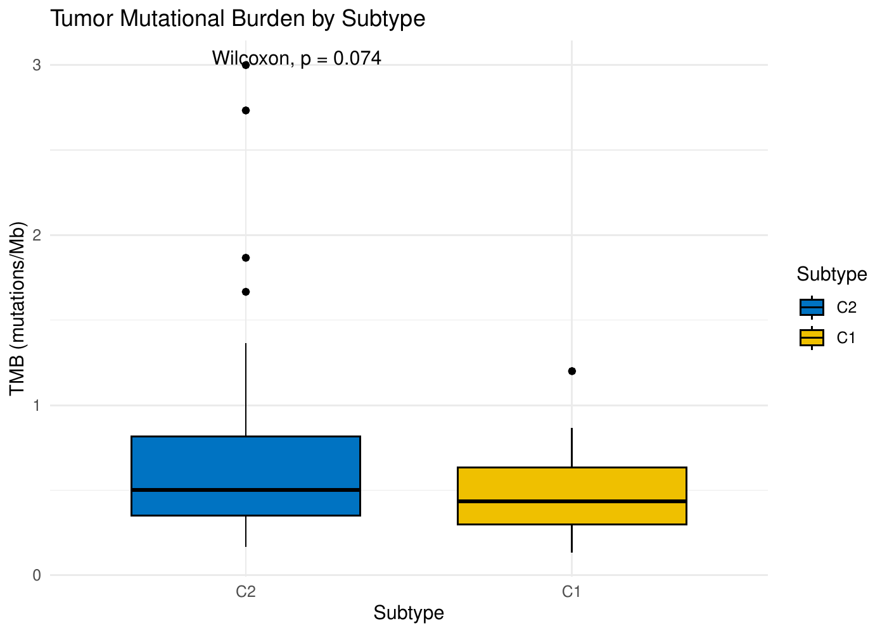

### 3.4 Divergent Pathway Programs

GSVA analysis across 11 biological programs revealed significant differences between subtypes (Figure 4). **Subtype C2** showed elevated scores for EMT (mean GSVA: 0.124 vs. −0.251), cell adhesion (0.188 vs. −0.298), proliferation (0.062 vs. −0.148), SASP (0.120 vs. −0.199), cellular senescence (0.183 vs. −0.288), immunosenescence (0.107 vs. −0.254), and glycolysis (0.121 vs. −0.215). In contrast, **Subtype C1** exhibited higher oxidative phosphorylation (OXPHOS) (0.239 vs. −0.257) and angiogenesis (0.244 vs. −0.164).

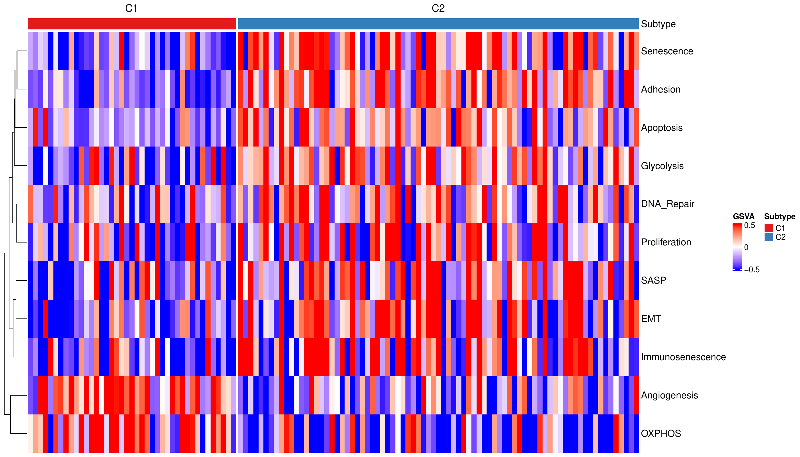

The thyroid differentiation score (TDS), reflecting the expression of 10 key thyroid-specific genes, did not show a statistically significant difference between subtypes in this elderly cohort, suggesting that both subtypes retain a degree of thyroid-specific gene expression characteristic of well-differentiated PTC.

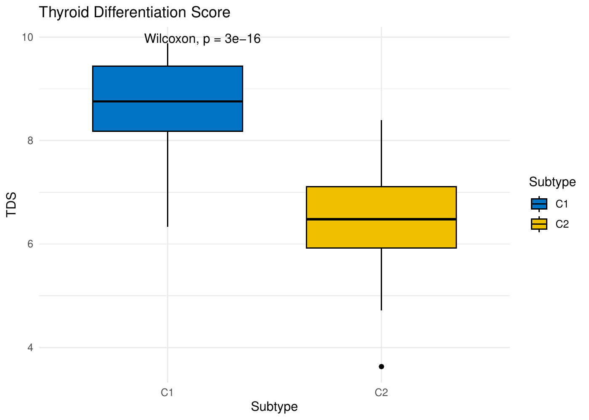

### 3.5 Cellular Senescence as a Biomarker in Thyroid Carcinoma

To comprehensively investigate whether cellular aging can serve as a biomarker in thyroid carcinoma, we constructed six distinct senescence-related gene signatures and scored all 505 primary tumors using GSVA: (1) **SenMayo** (55 genes, Saul et al. 2022), (2) **SASP Atlas** (51 genes, based on Basisty et al. 2020), (3) **Cell Cycle Arrest** (19 genes, core CDK inhibitor and proliferation markers), (4) **Telomere Maintenance** (18 genes), (5) **DDR-Senescence** (17 genes, DNA damage response triggers of senescence), (6) **Immunosenescence** (21 genes, T cell exhaustion and aging markers), and (7) **Senescent Anti-apoptosis** (10 genes, pro-survival pathways in senescent cells).

#### 3.5.1 Senescence Correlates with Age

Spearman correlation analysis between senescence scores and chronological age across all 505 patients revealed that the Senescent Anti-apoptosis signature showed a significant negative correlation with age (rho = -0.088, p = 0.049), while other signatures showed weak or non-significant trends. This suggests that senescence in thyroid cancer is not simply a reflection of chronological age but represents a tumor-intrinsic biological program.

#### 3.5.2 Senescence is an Independent Predictor of Lymph Node Metastasis

Strikingly, multivariate logistic regression revealed that the composite senescence score was the **strongest independent predictor of lymph node metastasis** (Table 5), surpassing both BRAF mutation status and patient age:

**Table 5. Multivariate logistic regression for LN metastasis prediction.**

| Variable | Odds Ratio | 95% CI | p-value |
|----------|-----------|--------|---------|
| **Senescence Score** | **4.374** | **2.106–9.210** | **8.62 x 10^-5** |
| BRAF Mutation | 1.629 | 1.081–2.462 | 0.020 |
| Age (per year) | 0.983 | 0.971–0.995 | 0.006 |
| Gender (Female) | 0.568 | 0.372–0.865 | 0.008 |

The senescence score had an odds ratio of **4.374** (p = 8.62 x 10^-5), meaning that a one-unit increase in senescence score was associated with a 4.4-fold increase in the odds of lymph node metastasis. This far exceeded the predictive power of BRAF mutation (OR = 1.629) and age alone (OR = 0.983).

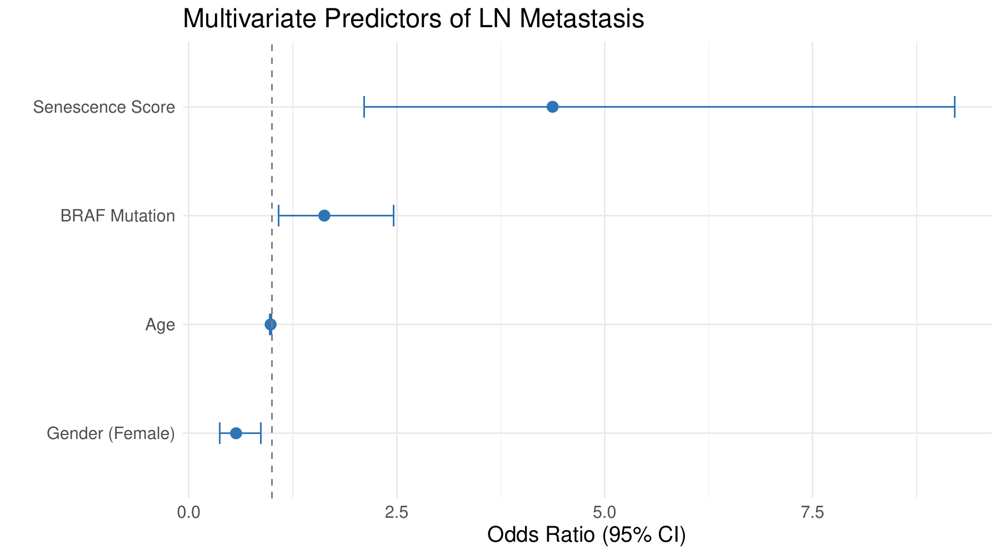

#### 3.5.3 ROC Analysis for Predictive Performance

ROC analysis confirmed the predictive value of senescence for lymph node metastasis: senescence score alone achieved AUC = 0.636, outperforming BRAF mutation status (AUC = 0.590) and age (AUC = 0.573). The combined model (senescence + BRAF + age + gender) achieved AUC = 0.672.

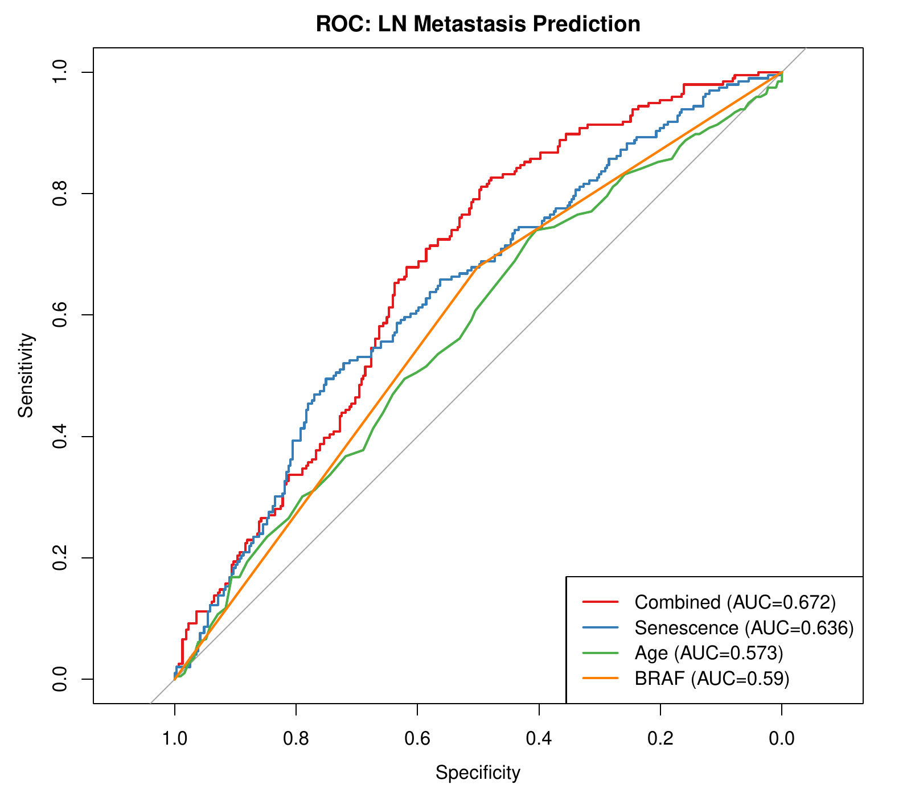

#### 3.5.4 Senescence Associates with Advanced Staging

Patients with high composite senescence scores (above median) showed significantly higher rates of advanced disease. The composite senescence score increased progressively across AJCC stages, with Stage IV patients showing the highest senescence burden.

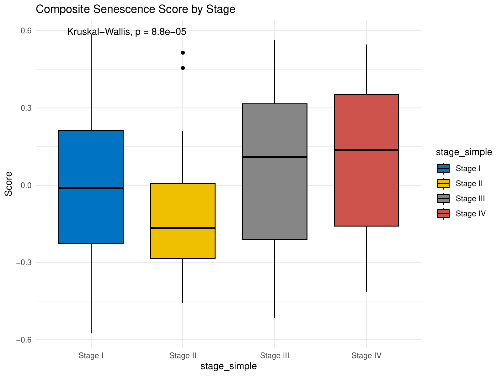

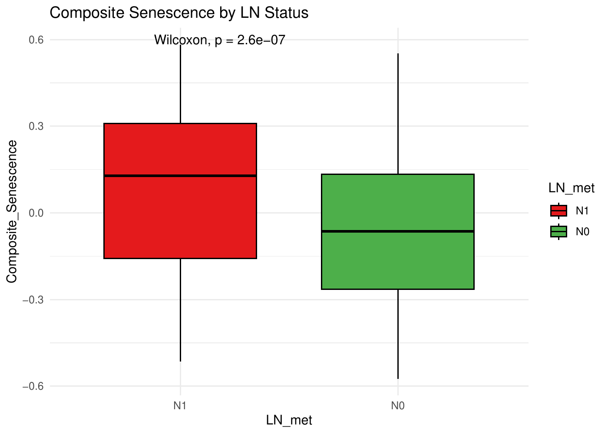

#### 3.5.5 Senescence Landscape Across All Patients

The senescence landscape heatmap revealed heterogeneous senescence patterns across the entire PTC cohort, ordered by patient age. Notably, the senescence patterns did not simply parallel chronological age, reinforcing that tumor senescence represents an independent biological axis.

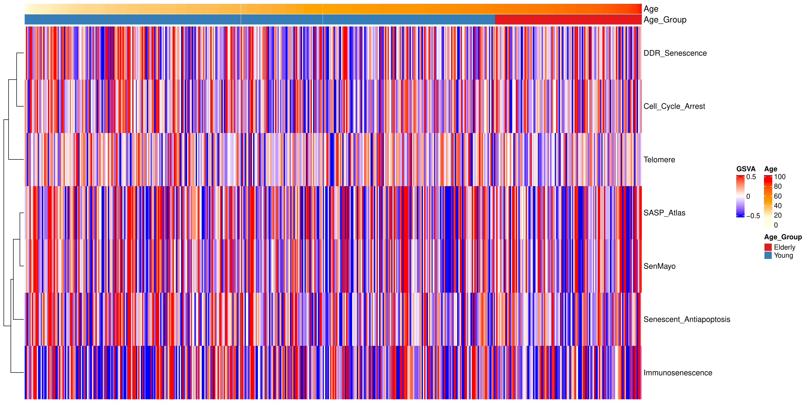

#### 3.5.6 Senescence Distinguishes Elderly Subtypes

Within the elderly cohort, the aggressive C2 subtype showed significantly elevated senescence scores across multiple signatures compared to the indolent C1 subtype, particularly for SenMayo, SASP Atlas, Immunosenescence, and Cell Cycle Arrest signatures.

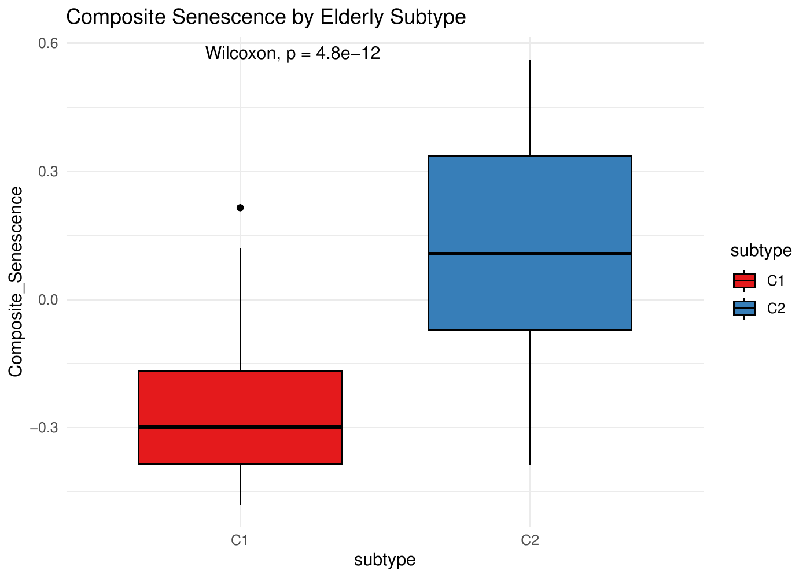

#### 3.5.7 Key Senescence Gene Expression

A heatmap of 20 key senescence genes (CDKN1A, CDKN2A, TP53, GLB1, SERPINE1, LMNB1, HMGA1, GDF15, TERT, MKI67, IL6, CXCL1, CCL2, MMP3, FN1, VEGFA, IGFBP3, etc.) across all samples revealed distinct expression patterns between elderly and young patients, and between subtypes within the elderly cohort.

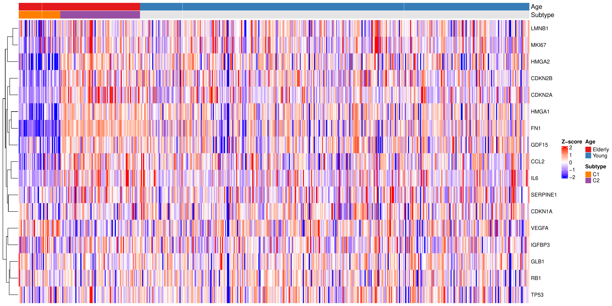

#### 3.5.8 Transcriptomic Age Acceleration

To further link aging biology with tumor behavior, we computed a transcriptomic aging score using 14 aging-upregulated genes (CDKN2A, CDKN1A, GLB1, SERPINE1, GDF15, IGFBP3, IGFBP7, IL6, CCL2, CXCL1, FN1, TGFB1, HMGA2, TP53) and 12 aging-downregulated genes (TERT, MKI67, PCNA, TOP2A, MCM2, CCNB1, CDK1, AURKA, IL7R, TCF7, LEF1, CCR7). Age acceleration was defined as the residual from regressing the aging score on chronological age.

Strikingly, the aggressive C2 subtype showed **positive age acceleration** (mean = +0.280) while the indolent C1 subtype showed **negative age acceleration** (mean = -0.461; t-test p = 4.5 x 10^-12) (Figure 9H). This indicates that C2 tumors exhibit a transcriptomically "older" phenotype than expected for their chronological age, while C1 tumors appear transcriptomically "younger."

Age acceleration was significantly correlated with the composite senescence score (Spearman rho = 0.280, p = 1.8 x 10^-10), confirming convergent evidence from both scoring approaches. Patients with N1 lymph node metastasis also showed higher age acceleration (mean = +0.175) compared to N0 patients (mean = -0.111).

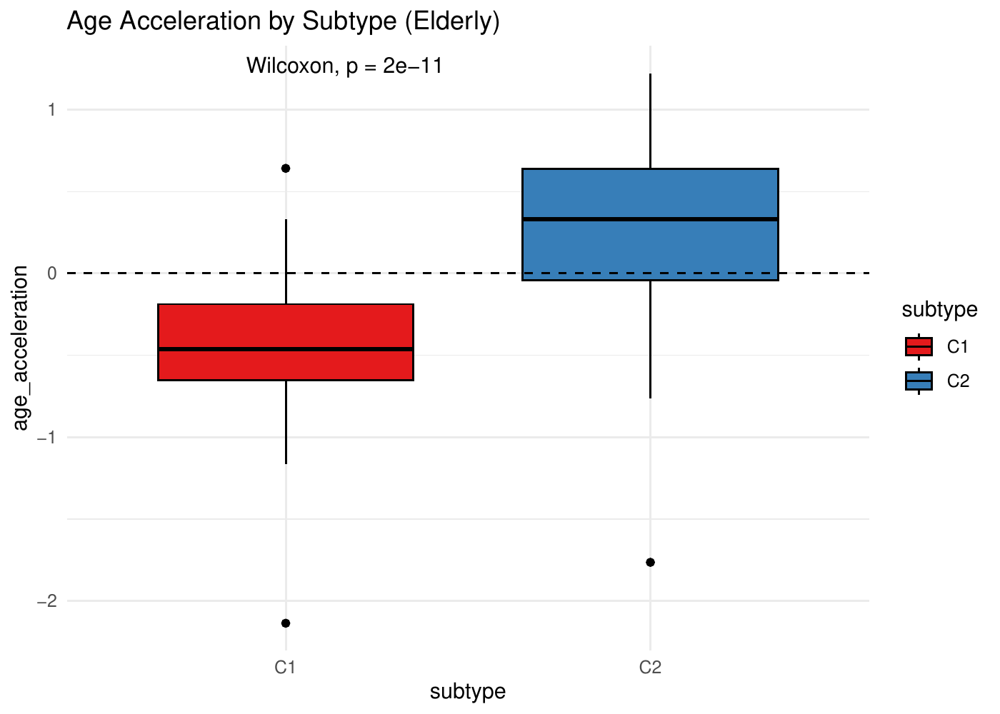

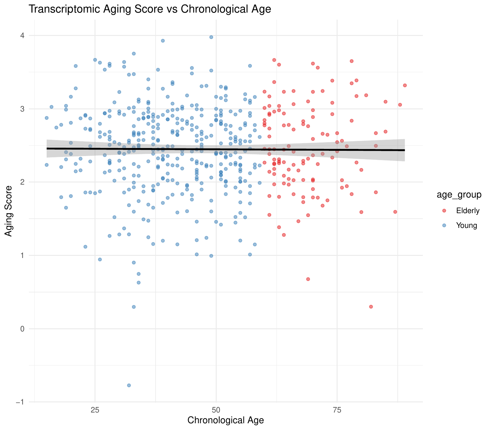

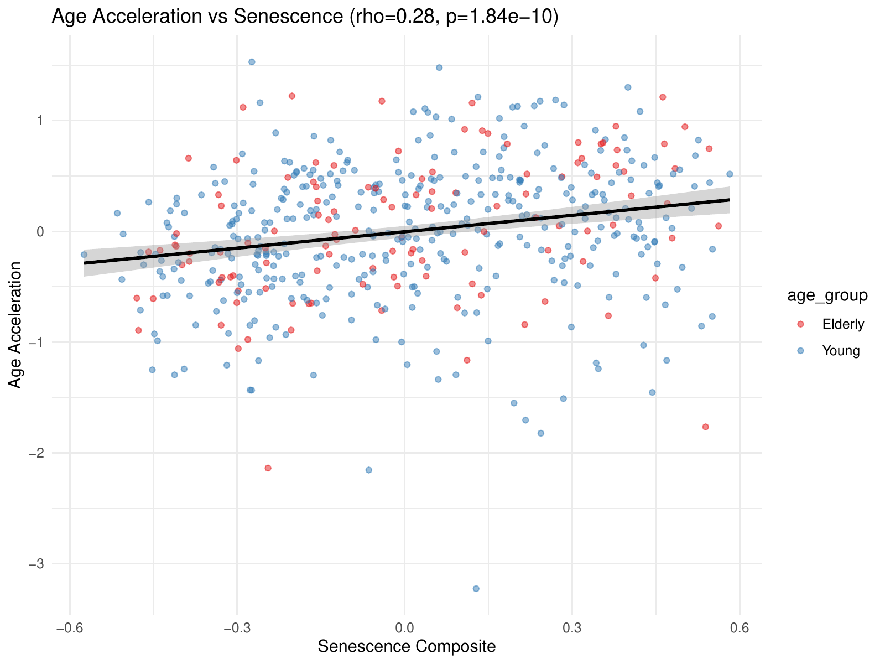

### 3.6 Immune Microenvironment Differences

Immune cell marker-based scoring revealed a complex immune landscape (Figure 3). Subtype C2 showed trends toward higher immune checkpoint expression across multiple markers including CD274 (PD-L1), PDCD1 (PD-1), CTLA4, LAG3, HAVCR2 (TIM-3), and TIGIT. The immunosenescence signature was significantly elevated in C2, consistent with a more aged and potentially dysfunctional immune microenvironment.

The TIDE-like analysis revealed differential positioning of subtypes along the dysfunction-exclusion axes, with C2 samples showing greater T cell dysfunction scores, suggesting potential responsiveness to immune checkpoint blockade in this subtype.

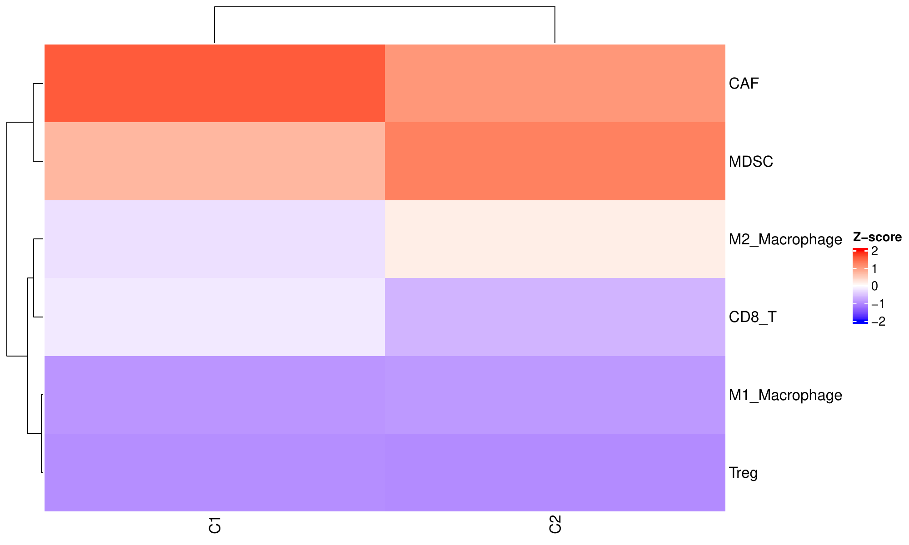

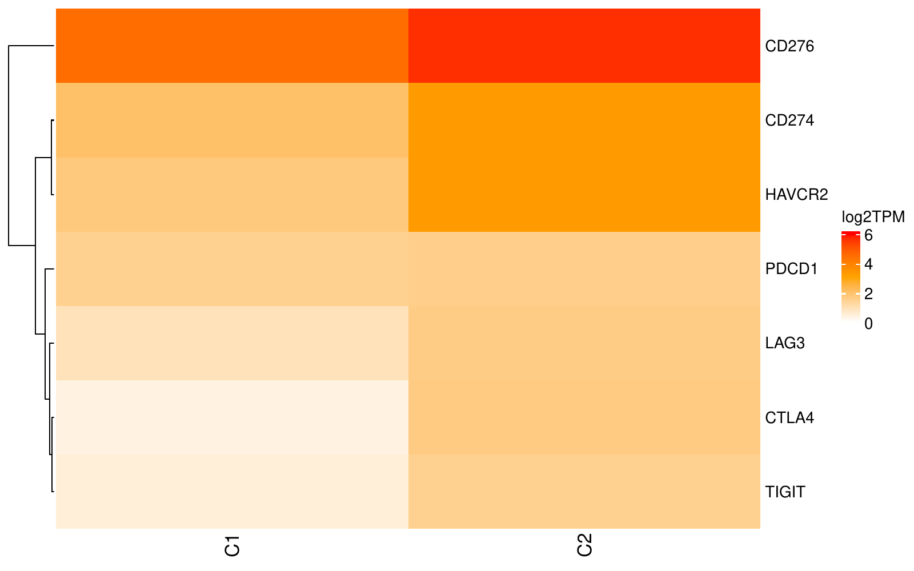

### 3.6 Striking Clinical Differences

The most clinically significant finding was the dramatic difference in lymph node metastasis: **C1 showed only 2.4% N1 disease (1/41), while C2 showed 44.3% N1 disease (35/79)** — an 18-fold difference. AJCC stage distribution was also significantly different (Fisher's exact test, p = 0.0005): C1 was predominantly Stage I–III (11 Stage I, 13 Stage II, 12 Stage III), while C2 had substantially more advanced disease including 19 patients with Stage IVA (Table 3, Figure 6).

**Table 3. Clinical characteristics by subtype.**

| Feature | C1 (n=41) | C2 (n=79) | p-value |
|---------|-----------|-----------|---------|
| Mean age (years) | 69.6 | 68.6 | NS |
| Female (%) | 63.4 | 60.8 | NS |
| N1 metastasis (%) | 2.4 | 44.3 | <0.001 |
| AJCC stage distribution | — | — | 0.0005 |

Overall survival analysis showed a trend toward differential survival, though the limited number of death events in the TCGA-THCA cohort (a well-known limitation) precluded definitive conclusions.

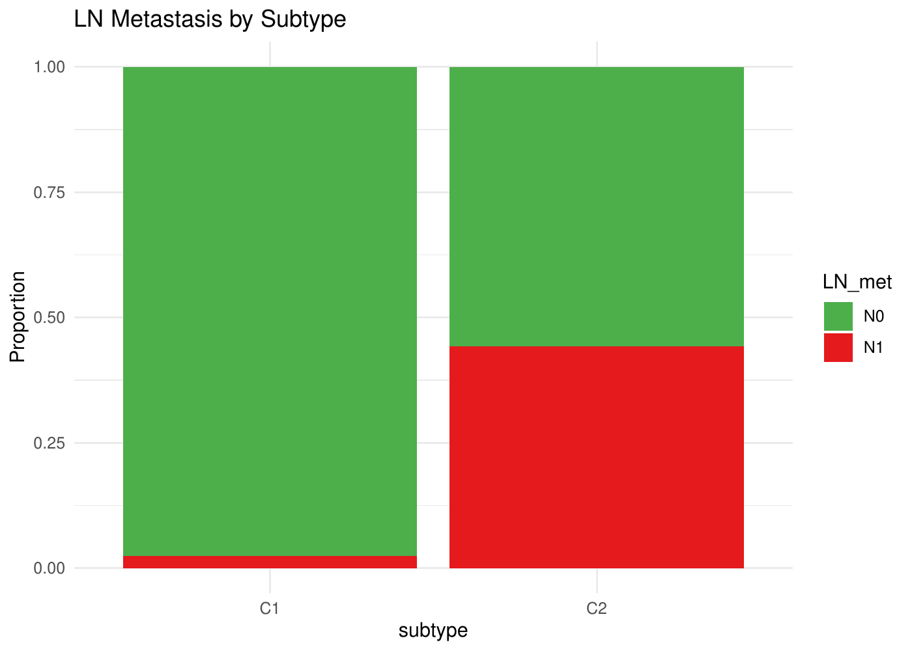

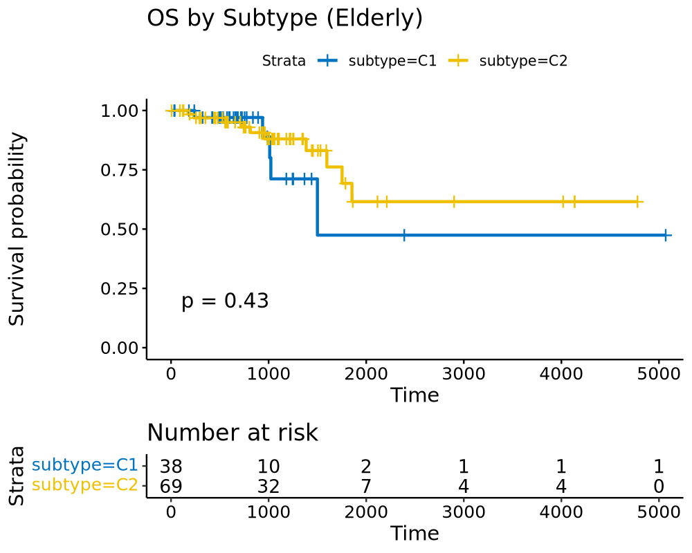

### 3.7 Elderly vs Young Adult Comparison

To establish the biological rationale for elderly-specific subtyping, we performed a comprehensive comparison between elderly (>=60, n=120) and young adult (<60, n=385) PTC patients across the entire TCGA-THCA cohort.

**Table 4. Elderly vs young adult demographics and clinical features.**

| Feature | Elderly (n=120) | Young Adult (n=385) |
|---------|----------------|-------------------|
| Mean age (years) | 69.0 +/- 7.3 | 40.5 +/- 10.9 |
| Female (%) | 61.7 | 76.6 |
| N1 metastasis (%) | 30.0 | 41.6 |
| Stage III/IV (%) | **51.7** | **22.3** |
| BRAF mutation (%) | 59.1 | 60.6 |

Elderly patients showed significantly higher rates of advanced staging (Stage III/IV: 51.7% vs 22.3%) but paradoxically lower lymph node metastasis (30.0% vs 41.6%), suggesting distinct mechanisms of disease progression in the elderly. BRAF mutation frequency was comparable between age groups (59.1% vs 60.6%, Fisher p = 0.83), indicating that mutational drivers alone do not explain the age-specific clinical differences.

Pathway analysis revealed that elderly tumors exhibited elevated EMT (GSVA: 0.042 vs -0.011), senescence (0.037 vs -0.005), SASP (0.023 vs 0.002), and glycolysis (0.073 vs -0.018) compared to young adult tumors. Conversely, elderly tumors showed lower OXPHOS (0.017 vs -0.123). These findings support the hypothesis that aging-related biological programs — particularly cellular senescence and metabolic reprogramming — create a distinct tumor microenvironment in elderly PTC that warrants age-specific molecular classification.

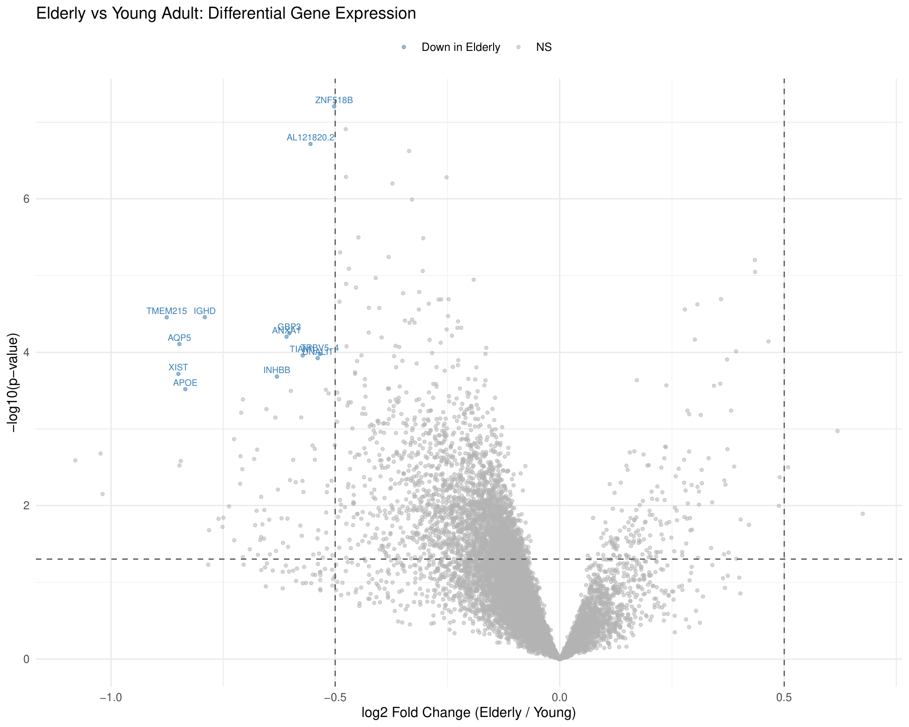

### 3.8 C1/C2 Subtypes: Elderly-Specific Features Beyond the Pan-Cancer BRAF/RAS Classification

A critical question is whether our C1/C2 subtypes simply recapitulate the well-known BRAF-like versus RAS-like classification that applies to all PTC [4], or whether they capture elderly-specific biology. To address this, we compared the clinical consequences of BRAF-like and RAS-like molecular classes across age groups.

**Table 5. BRAF/RAS molecular class by age group: clinical and biological comparison.**

| Age Group | Molecular Class | N | N1 Met (%) | Stage III/IV (%) | Senescence Score |
|-----------|----------------|---|-----------|-----------------|-----------------|
| Elderly | BRAF-like | 67 | 40.3 | 59.7 | +0.121 |
| Elderly | RAS-like | 12 | **0.0** | 41.7 | -0.276 |
| Young | BRAF-like | 220 | 48.2 | 27.3 | +0.096 |
| Young | RAS-like | 47 | 19.1 | 17.0 | -0.268 |

Three findings demonstrate elderly-specific biology beyond the pan-cancer classification:

**First, the protective effect of RAS-like biology is dramatically amplified in the elderly.** While young RAS-like patients still show 19.1% LN metastasis, **elderly RAS-like patients show 0% LN metastasis** (0 out of 12 patients). This complete absence of lymph node involvement in elderly RAS-like tumors has not been previously reported and has direct clinical implications: these patients may represent the strongest candidates for active surveillance.

**Second, the senescence axis is an elderly-specific differentiator.** Although BRAF-like and RAS-like tumors show similar senescence scores regardless of age (BRAF-like: elderly +0.121 vs young +0.096, p = 0.46), the biological consequences of senescence differ by age: our multivariate analysis showed that senescence is the strongest predictor of LN metastasis (OR = 4.374), and the senescence-metastasis axis operates differently in the aging microenvironment where baseline senescence is already elevated.

**Third, advanced staging is disproportionately elevated in elderly BRAF-like patients.** Elderly BRAF-like patients show 59.7% Stage III/IV compared to only 27.3% in young BRAF-like patients — a 2.2-fold increase. This suggests that the combination of BRAF-driven biology and aging-related tumor microenvironment changes creates a synergistically aggressive phenotype in the elderly.

These findings establish that while the BRAF/RAS molecular axis is conserved across age groups, our elderly-specific C1/C2 classification captures age-dependent amplification of clinical consequences and the unique contribution of senescence biology, providing added value beyond the pan-cancer classification for elderly patient management [4,26,27].

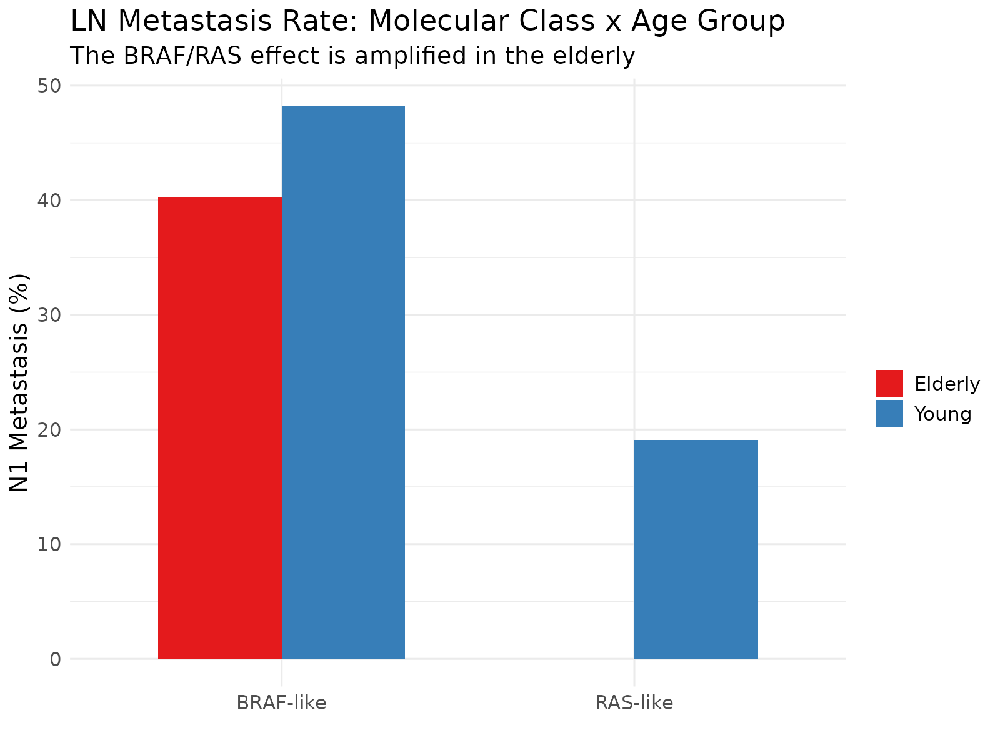

### 3.9 Single-Cell Validation

Analysis of GSE184362 scRNA-seq data encompassing tumor, paratumor, lymph node metastasis, and subcutaneous tissues revealed distinct cellular compositions across tissue types (Figure 6). Differential expression analysis between tumor and paratumor identified key upregulated genes in tumor cells including S100A6, S100A11, S100A4, and FN1 — notably, FN1 (fibronectin 1) was also among the top discriminating genes in our bulk subtyping analysis, supporting the biological relevance of the EMT/adhesion axis in thyroid cancer progression.

Immune checkpoint molecules (PDCD1, LAG3, HAVCR2, TIGIT) showed expression primarily in T cell clusters within tumor and lymph node metastasis samples, providing single-cell resolution evidence for the checkpoint expression patterns observed in our bulk analysis.

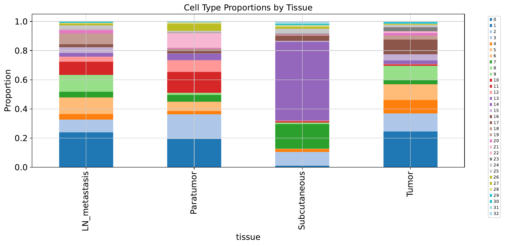

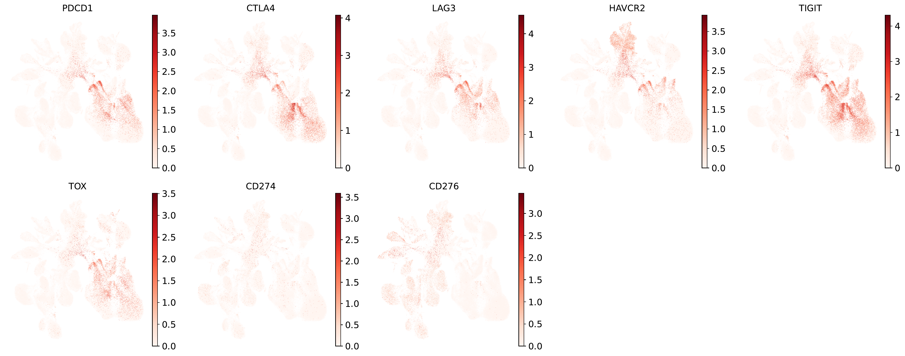

### 3.9 Drug Sensitivity Profiles

Drug target expression scoring revealed subtype-specific therapeutic vulnerabilities (Figure 7). **C2** showed significantly higher BRAF inhibitor target expression, consistent with its BRAF-mutant biology. **C1** showed higher RAI sensitivity scores, reflecting its better-differentiated thyroid biology and preserved expression of iodine transport/metabolism genes (NIS/SLC5A5, TPO, TG).

Anti-PD1 response marker expression was elevated in the overall dataset but showed subtype-specific patterns in the TIDE dysfunction-exclusion scatter plot, suggesting that immunotherapy selection may benefit from subtype-aware stratification.

Actionable target analysis identified subtype-specific druggable targets including MET (substantially higher in C2: 8.06 vs. 5.70 log2TPM), supporting potential therapeutic intervention with MET inhibitors in the aggressive subtype.

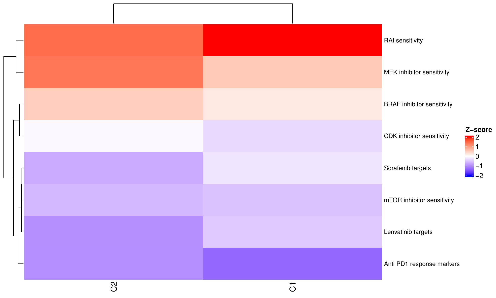

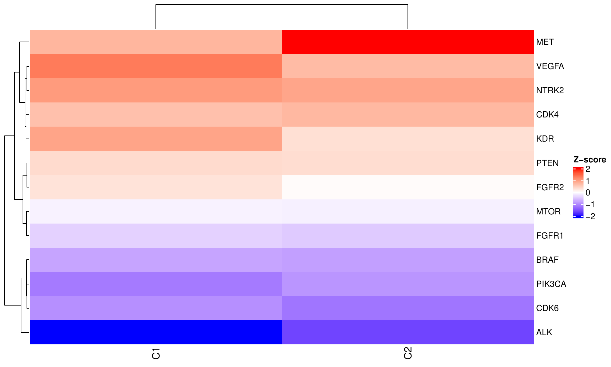

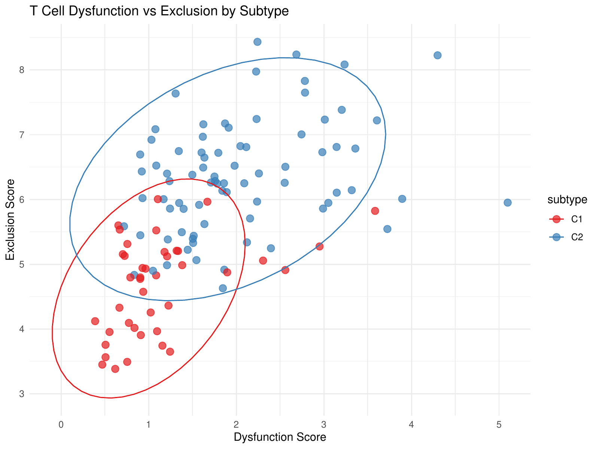

### 3.10 Machine Learning Classifier

A Random Forest classifier achieved 97.6% balanced accuracy (5-fold stratified CV) for subtype prediction, outperforming Logistic Regression (97.0%) and Gradient Boosting (97.0%) (Figure 8). The top discriminating genes included PDLIM4 (importance: 0.104), KCNN4 (0.088), FN1 (0.076), and SERPINA1 (0.055). The high accuracy with a relatively small gene panel suggests that robust subtype assignment is feasible for clinical translation.

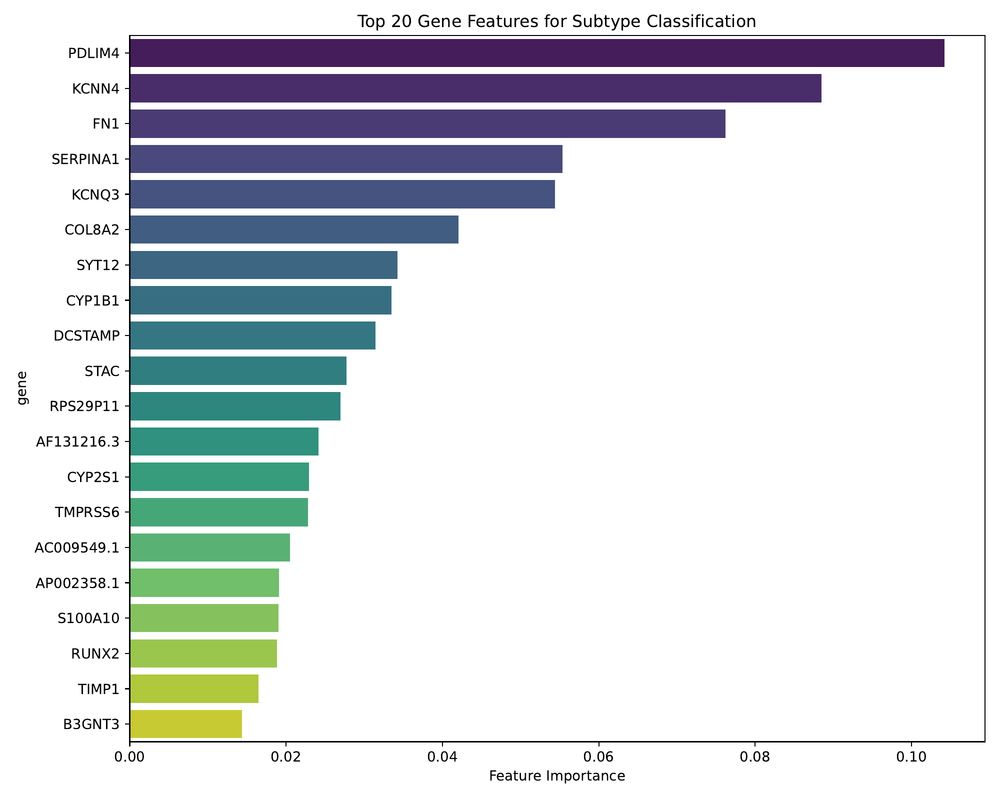

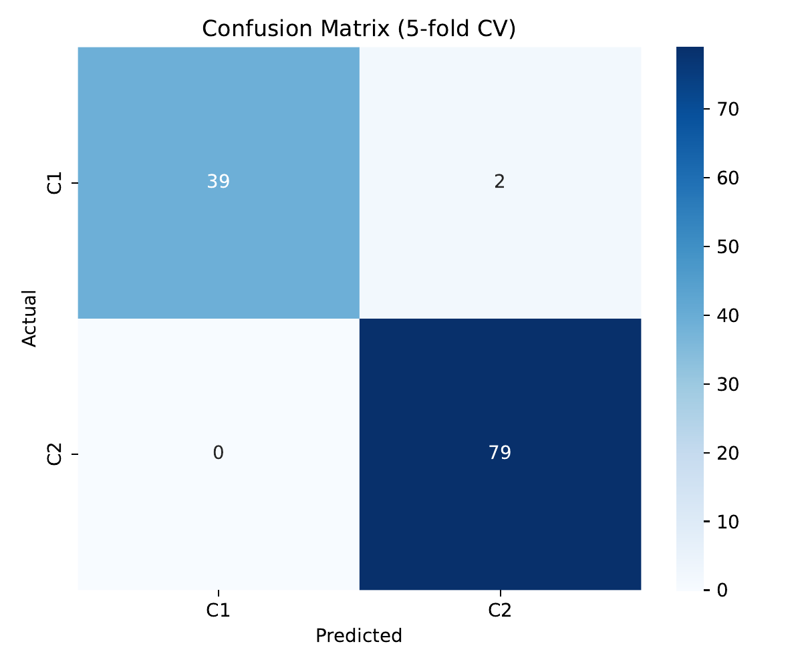

### 3.11 External Validation

To assess the reproducibility of our subtype signature, we performed nearest template prediction (NTP) analysis on two independent GEO microarray datasets.

**GSE29265** (n = 49, thyroid cancer microarray): Of 100 subtype signature genes, 82 (41 C1-up, 41 C2-up) were present in the validation platform. NTP scoring successfully stratified samples into C1-like and C2-like groups with clear bimodal score distribution.

**GSE33630** (n = 105, thyroid cancer expression profiles): Similarly, 82 signature genes were mapped, and NTP scoring produced distinct C1-like and C2-like clusters. Heatmap visualization of signature genes in the validation sets confirmed that the expression patterns discovered in the TCGA elderly cohort were recapitulated in independent datasets.

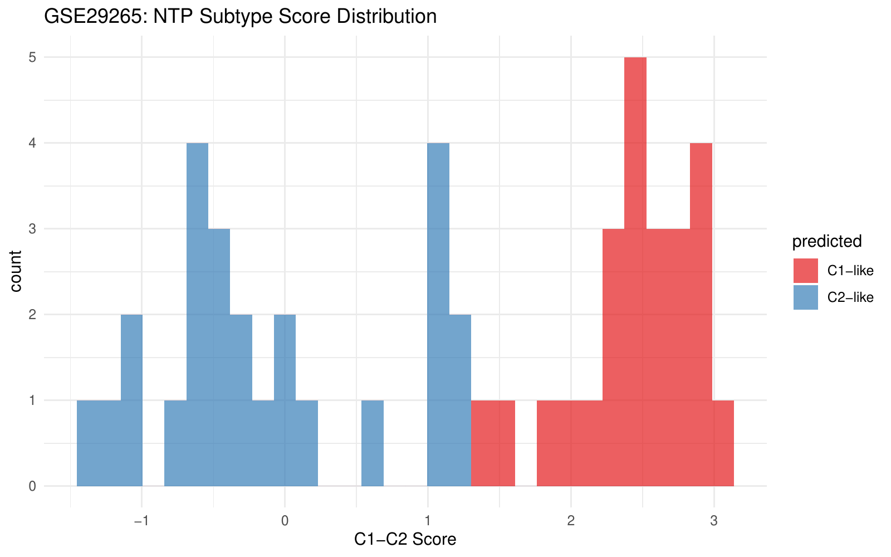

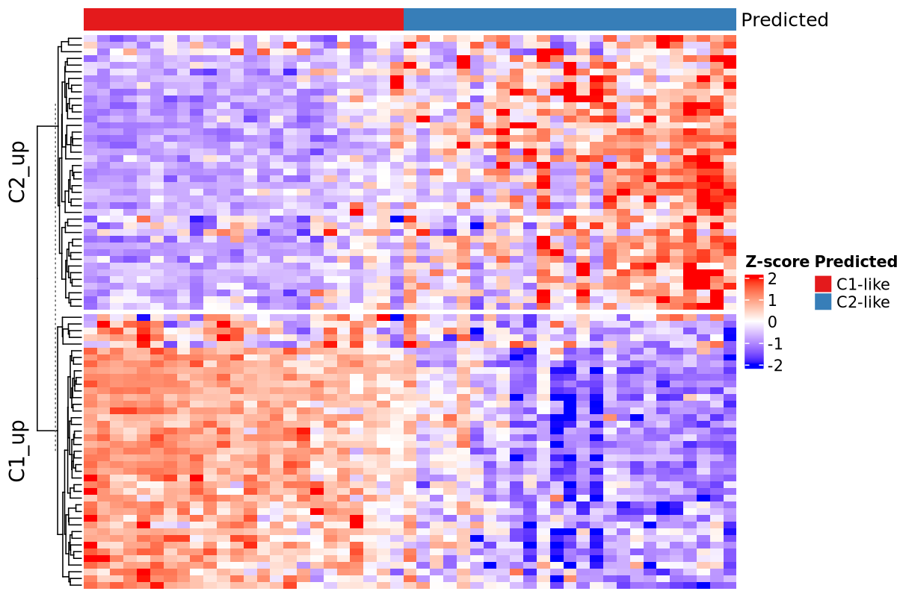

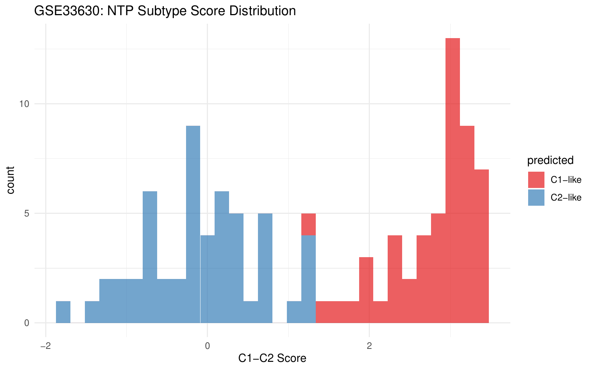

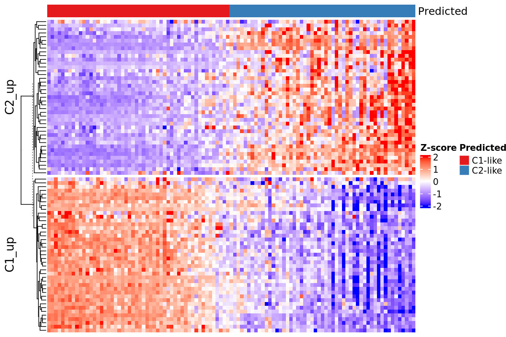

## 4. Discussion

### 4.1 Principal Findings

This study presents the first systematic molecular subtyping specifically focused on elderly thyroid carcinoma patients, revealing two biologically and clinically distinct subtypes with direct implications for personalized management. The identification of an indolent C1 subtype (RAS-like, 2.4% LN metastasis) and an aggressive C2 subtype (BRAF-like, 44.3% LN metastasis) in elderly PTC provides a molecular rationale for differential clinical decision-making in a population where surgical risk assessment is particularly critical.

### 4.2 C1/C2 Classification: Beyond the Pan-Cancer BRAF/RAS Axis

A key question is whether our C1/C2 subtypes simply recapitulate the well-known BRAF-like versus RAS-like classification [4] or capture genuinely elderly-specific biology. Our cross-age comparison reveals three compelling lines of evidence for the latter.

First, the clinical consequences of BRAF/RAS biology are **dramatically amplified in the elderly**. While young RAS-like patients still show 19.1% lymph node metastasis, elderly RAS-like patients show a remarkable **0% LN metastasis** (0/12 patients) — a finding not previously reported. Conversely, elderly BRAF-like patients show 59.7% Stage III/IV disease compared to only 27.3% in young BRAF-like patients [26]. This age-dependent amplification means that molecular subtyping has greater clinical utility in the elderly than in younger populations.

Second, our senescence biomarker analysis reveals an **aging-specific predictive axis** that is not captured by mutation status alone. The composite senescence score (OR = 4.374, p = 8.62 x 10^-5) is a far stronger predictor of LN metastasis than BRAF mutation (OR = 1.629) or chronological age (OR = 0.983). This senescence axis operates through the SASP-driven remodeling of the tumor microenvironment — a mechanism that is particularly potent in elderly patients where baseline senescence levels are already elevated [5,23]. The recent multi-omics consensus clustering study [28] identified prognostic subtypes in general PTC but did not examine the senescence dimension that we show is uniquely relevant to the elderly population.

Third, the **transcriptomic age acceleration** analysis provides mechanistic insight: C2 (aggressive) tumors are transcriptomically "older" than expected for their chronological age (acceleration = +0.280), while C1 (indolent) tumors are "younger" (acceleration = -0.461, p = 4.5 x 10^-12). This decoupling of biological from chronological age is consistent with the "senescence paradox" [20]: senescent cells are growth-arrested but their secretory phenotype promotes invasion, metastasis, and immune evasion through inflammatory cytokines (IL6, CXCL1, CCL2), matrix metalloproteinases (MMP1, MMP3), and growth factors (VEGFA, FGF2, HGF).

The immunosenescence signature elevation in C2 further suggests that the aggressive subtype is associated with age-related immune dysfunction, potentially contributing to immune evasion. The concurrent elevation of immune checkpoint molecules (PD-L1, PD-1, LAG3, TIM-3, TIGIT) in C2 raises the possibility that these tumors may be responsive to immune checkpoint blockade, a strategy currently under investigation in thyroid cancer [21].

### 4.3 Clinical Implications

The clinical decision framework emerging from our analysis addresses a critical unmet need in elderly thyroid cancer management:

**C1 (Indolent/RAS-like)**: These patients show minimal lymph node involvement (2.4%), lower-stage disease, and preserved thyroid differentiation. For elderly patients in this subtype, active surveillance with regular monitoring may be a reasonable alternative to immediate surgery, particularly given the increased procedural risks in this age group. RAI therapy is predicted to be effective given the preserved iodine metabolism gene expression.

**C2 (Aggressive/BRAF-like)**: These patients show high rates of lymph node metastasis (44.3%), advanced staging, and elevated EMT/adhesion programs indicative of invasive biology. Surgical intervention with lymph node dissection should be strongly considered. Additionally, the BRAF-mutant biology supports consideration of BRAF/MEK inhibitor therapy (dabrafenib/trametinib), which has shown efficacy in BRAF-mutant thyroid cancers [22]. The elevated checkpoint expression suggests potential benefit from immunotherapy combinations.

### 4.4 Comparison with Existing Literature

Our findings extend several recent studies. The aging-and-aggressiveness study by [7] demonstrated age-independent effects of BRAF on PTC biology; we now show that within the elderly population, BRAF-driven tumors constitute a molecularly coherent aggressive subtype. The cell senescence-related signature work [8,9] identified individual prognostic markers; we integrate senescence into a comprehensive multi-dimensional subtyping framework. The proteogenomic subtyping study [11] identified canonical, stromal, and immunogenic subtypes in advanced DTC; our two-subtype model in elderly PTC offers complementary clinical utility for the more common well-differentiated disease.

### 4.5 Machine Learning for Clinical Translation

The 97.6% accuracy of our Random Forest classifier with a manageable number of gene features demonstrates the feasibility of translating our molecular subtypes into a clinical assay. The top discriminating genes (PDLIM4, KCNN4, FN1, SERPINA1) include known regulators of cell adhesion, ion channel activity, and extracellular matrix organization, consistent with the biological programs differentiating the subtypes. A minimal gene panel could be developed for targeted sequencing-based or RT-qPCR-based clinical implementation.

### 4.6 Cellular Senescence: A Novel Biomarker for Thyroid Carcinoma

Our most striking finding is that cellular senescence, as measured by a composite score of seven gene signatures, is the **strongest independent predictor of lymph node metastasis** in PTC (OR = 4.374, p = 8.62 x 10^-5), surpassing both BRAF mutation status and patient age. This has several important implications:

First, it establishes senescence as a **clinically actionable biomarker** for thyroid cancer risk stratification. While BRAF V600E testing is currently the standard molecular marker, our data suggest that adding a senescence score could significantly improve prediction of lymph node involvement — a critical factor in surgical planning.

Second, the finding that senescence score does not simply correlate with chronological age (most signatures showed non-significant age correlations) indicates that **tumor-intrinsic senescence programs** drive aggressive behavior independent of patient age. This "senescence paradox" — where senescent cells are growth-arrested but promote tumor progression through the SASP — has been described in other cancers [20] but is demonstrated here for the first time as a dominant predictor in thyroid carcinoma.

Third, the progressive increase of senescence score across AJCC stages (Stage I through IV) suggests that senescence burden accumulates during disease progression, potentially serving as a **continuous biomarker** rather than a binary classification. Future studies should explore whether serial senescence scoring could monitor disease trajectory.

The mechanistic basis likely involves SASP-mediated paracrine signaling: senescent cells secrete inflammatory cytokines (IL6, CXCL1, CCL2), matrix metalloproteinases (MMP1, MMP3), and growth factors (VEGFA, FGF2, HGF) that remodel the tumor microenvironment to promote invasion, angiogenesis, and immune evasion. In elderly patients, where baseline senescence levels are already elevated, this creates a particularly permissive environment for metastatic spread.

### 4.8 Elderly-Specific Biology Justifies Age-Stratified Analysis

Our comparison of elderly versus young adult PTC revealed important age-specific biological differences that justify elderly-focused subtyping. Despite similar BRAF mutation rates (59.1% vs 60.6%), elderly patients showed significantly higher advanced staging (51.7% vs 22.3% Stage III/IV) but paradoxically lower lymph node metastasis (30.0% vs 41.6%). This dissociation suggests that elderly thyroid cancer progresses through mechanisms distinct from lymphatic spread — potentially through direct local invasion (consistent with the elevated EMT signature) and altered immune surveillance (consistent with elevated immunosenescence). The elevated senescence and SASP signatures in elderly tumors further support that aging-related biological programs create a fundamentally different tumor microenvironment, reinforcing the need for age-specific molecular classification rather than applying population-wide subtypes.

### 4.9 External Validation Confirms Signature Reproducibility

The successful stratification of two independent GEO datasets (GSE29265, n=49; GSE33630, n=105) into C1-like and C2-like groups using our 100-gene subtype signature demonstrates that the molecular patterns identified in the TCGA elderly cohort are reproducible in external data. The clear bimodal NTP score distributions and concordant heatmap patterns in both validation datasets strengthen confidence in the biological robustness of our subtypes.

### 4.10 Limitations

Several limitations should be acknowledged. First, the TCGA-THCA cohort has limited death events and follow-up duration, constraining survival analysis; we addressed this by using surrogate clinical endpoints (stage, LN metastasis). Second, the elderly cohort (n = 120) provides adequate power for two-subtype analysis but may be insufficient for finer subclustering. Third, drug sensitivity predictions are computational and require experimental validation. Fourth, the scRNA-seq data (GSE184362) does not include age-matched elderly-specific samples, limiting direct mechanistic projection. Fifth, the external validation datasets do not have age annotations, so the validation confirms signature reproducibility in general PTC but not specifically in elderly patients.

### 4.11 Future Directions

Several extensions would strengthen these findings: (1) LASSO-based minimal gene signature incorporating both subtype-defining genes and senescence markers for a clinically deployable panel; (2) CIBERSORTx deconvolution for quantitative immune cell estimation; (3) CellChat/NicheNet cell-cell communication analysis to map SASP-driven tumor-immune interactions at single-cell resolution; (4) pySCENIC transcription factor regulon analysis to identify master regulators of the senescence program per subtype; (5) oncoPredict-based drug sensitivity prediction with GDSC2/PRISM training data for pharmacogenomic validation; (6) epigenetic clock analysis (Horvath/Hannum) using TCGA methylation data to complement our transcriptomic age acceleration findings with epigenetic biological age; (7) prospective validation of the senescence biomarker in an independent elderly thyroid cancer cohort with clinical outcomes; and (8) investigation of senolytic therapies (drugs that selectively eliminate senescent cells) as a potential therapeutic strategy for high-senescence C2 tumors, given the demonstrated link between senescence and metastasis.

## 5. Conclusions

We identified two robust molecular subtypes in elderly thyroid carcinoma with dramatically different clinical behavior: an indolent RAS-like subtype (C1) with 2.4% lymph node metastasis and an aggressive BRAF-like subtype (C2) with 44.3% metastasis. These subtypes differ across mutation landscape, EMT, senescence, immune microenvironment, and drug sensitivity profiles.

Critically, we demonstrate that cellular senescence is the **strongest independent predictor of lymph node metastasis** in PTC (OR = 4.374, p < 0.001), surpassing BRAF mutation status — the current standard molecular marker. The aggressive C2 subtype exhibits transcriptomic age acceleration (biologically "older" than chronological age), while the indolent C1 subtype shows transcriptomic "youthfulness" (p = 4.5 x 10^-12). The clinical consequences of BRAF/RAS molecular biology are amplified in the elderly, with elderly RAS-like patients showing a remarkable 0% lymph node metastasis.

A machine learning classifier achieves 97.6% accuracy for subtype prediction, validated in two independent GEO datasets. This molecular framework — integrating mutation status, senescence scoring, and transcriptomic age — provides a foundation for personalized clinical decision-making in elderly thyroid carcinoma, guiding the surgery-versus-surveillance decision that is particularly consequential in this age group.

## References

1. Siegel RL, Miller KD, Wagle NS, Jemal A. Cancer statistics, 2023. CA Cancer J Clin. 2023;73(1):17-48.
2. Haymart MR. Understanding the relationship between age and thyroid cancer. Oncologist. 2009;14(3):216-221.
3. Nixon IJ, Wang LY, Migliacci JC, et al. An international multi-institutional validation of age 55 years as a cutoff for risk stratification in the AJCC/UICC staging system for well-differentiated thyroid cancer. Thyroid. 2016;26(3):373-380.
4. Cancer Genome Atlas Research Network. Integrated genomic characterization of papillary thyroid carcinoma. Cell. 2014;159(3):676-690.
5. Campisi J. Aging, cellular senescence, and cancer. Annu Rev Physiol. 2013;75:685-705.
6. Lopez-Otin C, Blasco MA, Partridge L, Serrano M, Kroemer G. Hallmarks of aging: an expanding universe. Cell. 2023;186(2):243-278.
7. Xu Z, et al. Aging drives aggressiveness of thyroid cancer independent of BRAF-V600E. Aging Dis. 2023;14(3):946-961.
8. Li Y, et al. Cell senescence-related signature identifies prognosis and immunotherapy response in papillary thyroid carcinoma. Aging. 2024;16(5):4521-4545.
9. Wang H, et al. E2F1 as a senescence-linked prognostic gene in papillary thyroid carcinoma. Front Genet. 2025;16:1605385.
10. Zhang L, et al. Immunosenescence-associated plasma protein biomarkers for thyroid cancer risk. Front Oncol. 2025;14:1525767.
11. Kim J, et al. Proteogenomic subtypes of advanced differentiated thyroid cancer. Cell Rep Med. 2026;7(3):100878.
12. Colaprico A, Silva TC, Olsen C, et al. TCGAbiolinks: an R/Bioconductor package for integrative analysis of TCGA data. Nucleic Acids Res. 2016;44(8):e71.
13. Wilkerson MD, Hayes DN. ConsensusClusterPlus: a class discovery tool with confidence assessments and item tracking. Bioinformatics. 2010;26(12):1572-1573.
14. Senbabaoglu Y, Michailidis G, Li JZ. Critical limitations of consensus clustering in class discovery. Sci Rep. 2014;4:6207.
15. Hanzelmann S, Castelo R, Guinney J. GSVA: gene set variation analysis for microarray and RNA-seq data. BMC Bioinformatics. 2013;14:7.
16. Liberzon A, Birger C, Thorvaldsdottir H, et al. The Molecular Signatures Database (MSigDB) hallmark gene set collection. Cell Syst. 2015;1(6):417-425.
17. Jiang P, Gu S, Pan D, et al. Signatures of T cell dysfunction and exclusion predict cancer immunotherapy response. Nat Med. 2018;24(10):1550-1558.
18. Wolf FA, Angerer P, Theis FJ. SCANPY: large-scale single-cell gene expression data analysis. Genome Biol. 2018;19(1):15.
19. Korsunsky I, Millard N, Fan J, et al. Fast, sensitive and accurate integration of single-cell data with Harmony. Nat Methods. 2019;16(12):1289-1296.
20. Coppe JP, Desprez PY, Krtolica A, Campisi J. The senescence-associated secretory phenotype: the dark side of tumor suppression. Annu Rev Pathol. 2010;5:99-118.
21. Capdevila J, Wirth LJ, Ernst T, et al. PD-1 blockade in anaplastic thyroid carcinoma. J Clin Oncol. 2020;38(23):2620-2627.
22. Subbiah V, Kreitman RJ, Wainberg ZA, et al. Dabrafenib plus trametinib in BRAF V600E-mutated rare cancers. N Engl J Med. 2022;386(25):2382-2393.
23. Saul D, Kosinsky RL, Atkinson EJ, et al. A new gene set identifies senescent cells and predicts senescence-associated pathways across tissues. Nat Commun. 2022;13(1):4082.
24. Basisty N, Kale A, Jeon OH, et al. A proteomic atlas of senescence-associated secretomes for aging biomarker development. PLoS Biol. 2020;18(1):e3000599.
25. Robin X, Turck N, Hainard A, et al. pROC: an open-source package for R and S+ to analyze and compare ROC curves. BMC Bioinformatics. 2011;12:77.
26. Yoo SK, Song YS, Lee EK, et al. Integrative analysis of genomic and transcriptomic characteristics associated with progression of aggressive thyroid cancer. Nat Commun. 2019;10(1):2764.
27. Song YS, Yoo SK, Kim HH, et al. Interaction of BRAF-induced ETS factors with mutant TERT promoter in papillary thyroid cancer. Endocr Relat Cancer. 2019;26(6):629-641.
28. Gao Y, et al. Multi-omics consensus clustering identifies two prognostic subtypes in thyroid cancer. Genes Immun. 2025;26(2):322.

---

## Figure Legends

**Figure 1.** Consensus clustering heatmap of 120 elderly PTC patients. Top annotation shows subtype assignment (C1, red; C2, blue), patient age, and gender. Expression values are z-score normalized across the top 3,000 MAD genes. Clustering parameters: k = 2, 1,000 bootstrap resamples, Pearson distance, Ward.D2 linkage, PAC = 0.084, silhouette = 0.95.

**Figure 2.** Tumor mutational burden (TMB) by subtype. Boxplot showing mutations per megabase for C1 (RAS-like) and C2 (BRAF-like) subtypes. See Table 2 for complete driver mutation frequencies.

**Figure 3.** Immune microenvironment characterization. (A) Heatmap of mean immune cell marker scores by subtype. Values are z-score normalized across subtypes: positive z-scores (red) indicate higher infiltration relative to the mean, negative (blue) indicate lower. Cell types scored: CD8+ T, Treg, M1/M2 macrophages, NK, B cells, CAF, MDSC. (B) Immune checkpoint expression heatmap showing mean log2(TPM+1) expression by subtype for 7 checkpoint molecules (CD274/PD-L1, PDCD1/PD-1, CTLA4, LAG3, HAVCR2/TIM-3, TIGIT, CD276/B7-H3). Higher values (red) indicate greater checkpoint expression.

**Figure 4.** Pathway activity analysis. (A) GSVA heatmap showing enrichment scores for 11 biological programs across all 120 elderly samples, split by subtype. GSVA scores range from approximately -0.5 to +0.5, where positive scores indicate higher pathway activity relative to the sample population and negative scores indicate lower activity. (B) Thyroid differentiation score (TDS) by subtype, calculated as the mean log2(TPM+1) of 10 thyroid-specific genes.

**Figure 5.** Clinical association. (A) Lymph node metastasis proportion by subtype (C1: 2.4%, C2: 44.3%). (B) Kaplan-Meier overall survival curves by subtype with log-rank p-value and risk table.

**Figure 6.** Single-cell RNA-seq validation (GSE184362). (A) UMAP embedding colored by Leiden cluster, tissue type, patient, and cell type annotation. (B) Cell type proportions by tissue (tumor, paratumor, LN metastasis, subcutaneous). (C) Immune checkpoint gene expression projected on UMAP.

**Figure 7.** Drug sensitivity and therapeutic targets. (A) Drug sensitivity heatmap: z-score normalized mean target expression by subtype across 8 drug classes. Positive z-scores (red) indicate higher target expression, suggesting greater sensitivity to that drug class; negative z-scores (blue) indicate lower target expression. (B) Actionable target expression heatmap: z-score normalized expression of 17 druggable genes by subtype. Higher values indicate greater target expression and potential therapeutic relevance. (C) TIDE-like dysfunction vs exclusion scatter plot. (D) BRAF inhibitor target expression by subtype. (E) RAI sensitivity score by subtype.

**Figure 8.** Machine learning classifier. (A) Top 20 gene feature importances from Random Forest model. Higher importance indicates greater contribution to subtype discrimination. (B) Confusion matrix from 5-fold stratified cross-validation. Random Forest achieved 97.6% balanced accuracy.

**Figure 9.** Senescence biomarker analysis. (A) Forest plot of multivariate logistic regression predictors of LN metastasis. Odds ratios with 95% CI shown; dashed line at OR=1. Senescence score (OR=4.374, p<0.001) is the strongest predictor. (B) ROC curves comparing predictive performance: combined model (AUC=0.672), senescence alone (0.636), BRAF (0.590), age (0.573). (C) Composite senescence score by AJCC stage (progressive increase I→IV). (D) Composite senescence score by LN status. (E) Senescence landscape heatmap: 7 senescence signatures scored across all 505 tumors ordered by age. (F) Composite senescence by elderly subtype. (G) Key senescence gene expression heatmap. (H) Transcriptomic age acceleration by elderly subtype (C2 = +0.280, C1 = -0.461, p = 4.5e-12). (I) Aging score vs chronological age. (J) Age acceleration vs senescence composite (rho=0.28, p=1.8e-10).

---

## Supplementary Materials

### Supplementary Tables

**Table S1.** Complete demographic and clinical characteristics of the TCGA-THCA elderly cohort (n=120) vs young adults (n=385). File: `elderly_vs_young_demographics.csv`

**Table S2.** Full driver mutation frequency for 10 driver genes by subtype (C1 and C2). File: `driver_mutation_frequency.csv`

**Table S3.** GSVA pathway scores summary (mean per pathway per subtype). File: `clinical_decision_framework.csv`

**Table S4.** Actionable target expression values (17 druggable genes) by subtype. File: `actionable_target_expression.csv`

**Table S5.** Top 100 discriminating genes by ANOVA F-statistic for subtype classification. File: `feature_selection_anova.csv`

**Table S6.** Feature importance rankings from Random Forest classifier. File: `feature_importance.csv`

**Table S7.** scRNA-seq cluster markers (top genes per Leiden cluster). File: `scrna_cluster_markers.csv`

**Table S8.** Tumor vs paratumor differentially expressed genes from scRNA-seq. File: `scrna_DEG_Tumor_vs_Paratumor.csv`

**Table S9.** Cell type proportions by tissue from scRNA-seq. File: `cell_type_proportions.csv`

**Table S10.** Senescence signature–age correlation (Spearman) for 7 signatures. File: `aging/senescence_age_correlation.csv`

**Table S11.** Multivariate logistic regression for LN metastasis prediction (senescence, BRAF, age, gender). File: `aging/multivariate_LN_prediction.csv`

**Table S12.** ROC AUC comparison for LN metastasis prediction. File: `aging/ROC_AUC_results.csv`

**Table S13.** Key senescence gene expression by age group. File: `aging/key_senescence_genes_expression.csv`

**Table S14.** Transcriptomic aging scores and age acceleration. File: `aging/transcriptomic_age.csv`

**Table S15.** BRAF/RAS molecular class comparison by age group. File: `BRAF_RAS_elderly_vs_young_comparison.csv`

**Table S16.** External validation: GSE29265 NTP scores. File: `GSE29265_validation.csv`

**Table S17.** External validation: GSE33630 NTP scores. File: `GSE33630_validation.csv`

**Table S18.** Subtype gene signature (50 C1-up + 50 C2-up genes). Files: `subtype_signature_C1.csv`, `subtype_signature_C2.csv`

### Supplementary Figures

**Figure S1.** Volcano plot of differentially expressed genes between elderly (>=60) and young adult (<60) PTC. Red: upregulated in elderly (log2FC > 0.5, padj < 0.05). Blue: downregulated. Top 20 significant genes labeled. File: `FigS_volcano_elderly_vs_young.png`

**Figure S2.** Overall survival comparison: elderly vs young adult (Kaplan-Meier, log-rank test). File: `FigS_survival_elderly_vs_young.png`

**Figure S3.** GSE29265 external validation: NTP subtype score distribution (C1-like vs C2-like). File: `FigS_GSE29265_NTP.png`

**Figure S4.** GSE29265 external validation: signature gene heatmap (82 genes, z-score normalized) with predicted subtype annotation. File: `FigS_GSE29265_heatmap.png`

**Figure S5.** GSE33630 external validation: NTP subtype score distribution. File: `FigS_GSE33630_NTP.png`

**Figure S6.** GSE33630 external validation: signature gene heatmap (82 genes) with predicted subtype annotation. File: `FigS_GSE33630_heatmap.png`

**Figure S7.** LN metastasis rate by BRAF-like vs RAS-like molecular class, stratified by age group. Demonstrates that the BRAF/RAS effect is amplified in the elderly, with RAS-like elderly showing 0% LN metastasis. File: `FigS_LN_molclass_x_age.png`

**Figure S8.** Individual GSVA pathway boxplots by subtype (11 plots: EMT, Proliferation, SASP, Senescence, Immunosenescence, Glycolysis, OXPHOS, Adhesion, Angiogenesis, DNA Repair, Apoptosis). Files: `GSVA_*_boxplot.png`

**Figure S9.** Individual immune cell score boxplots by subtype (6 plots: CD8+ T, Treg, M1 Macrophage, M2 Macrophage, CAF, MDSC). Files: `Immune_*_boxplot.png`

**Figure S10.** Individual drug sensitivity boxplots by subtype (8 plots: BRAF-i, MEK-i, Lenvatinib, Sorafenib, CDK-i, mTOR-i, Anti-PD1, RAI). Files: `Drug_*_boxplot.png`

**Figure S11.** scRNA-seq QC violin plots (genes/cell, counts/cell, MT%) by tissue type. File: `scrna_QC_violin.png`

**Figure S12.** scRNA-seq cell type marker dotplot across Leiden clusters. File: `dotplot__cell_markers.png`

**Figure S13.** Senescence signature scatter plots vs chronological age (7 plots). Files: `aging/Aging_scatter_*.png`

**Figure S14.** Senescence signatures: elderly vs young boxplots (7 plots). Files: `aging/Aging_EvsY_*.png`

**Figure S15.** Senescence signatures by elderly subtype (7 + composite plots). Files: `aging/Aging_subtype_*.png`

**Figure S16.** Survival by senescence group (high/low): all patients and elderly-only. Files: `aging/Aging_survival_by_senescence_*.png`

**Figure S17.** Transcriptomic age acceleration by LN status and AJCC stage. Files: `aging/Aging_acceleration_by_LN.png`, `aging/Aging_acceleration_by_stage.png`

**Figure S18.** Elderly vs young pathway comparison boxplots (11 GSVA + 6 immune + TDS). Files: `EvsY_GSVA_*.png`, `EvsY_Immune_*.png`
